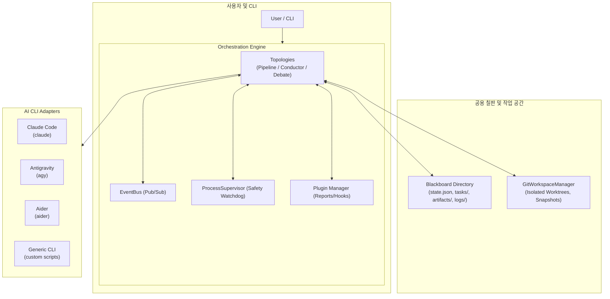

# ModueHarness (모두의 하네스)

[](CHANGELOG.md)
[](LICENSE)
[](pyproject.toml)
[](tests/)

**ModueHarness**는 다양한 AI CLI 도구(Claude Code, Google Antigravity, Aider 등)를 하나의 유기적인 팀으로 오케스트레이션하여 소프트웨어 엔지니어링 작업을 자율적·협업적으로 해결하는 **Multi-AI CLI 하네스(Harness) 프레임워크**입니다.

---

## 🌟 핵심 특징

- **🔌 통일된 CLI 어댑터 계층 (`adapters`)**:
  - Claude Code(`claude`), Antigravity CLI(`agy`), Aider(`aider`) 및 임의의 쉘 명령어를 단일 인터페이스(`BaseCLIAdapter`)로 추상화.
  - ANSI 컬러/이스케이프 시퀀스 자동 제거, 표준 입출력 스트리밍(`execute_stream`), 프로세스 타임아웃 감시.
- **📋 공용 칠판 아키텍처 (`blackboard/`)**:
  - AI CLI 프로세스들이 투명하게 공유할 수 있는 프로젝트 내 가시 폴더(`blackboard/`) 제공.
  - 세션 상태(`state.json`), 태스크 큐(`tasks/`), 교환 산출물(`artifacts/`), 실행 로그(`logs/`)를 파일 시스템 기반으로 관리.
- **🔄 다양한 협업 토폴로지 지원 (`engine`)**:
  1. **파이프라인 (Pipeline)**: 산출물 연쇄 전달(Handoff) 및 조건부/재시도 순차 릴레이.
  2. **지휘자-워커 (Leader-Worker / Conductor)**: Conductor AI가 목표를 분석하여 하위 작업을 동적으로 분해·할당하고 최종 종합.
  3. **토론 및 합의 (Debate & Consensus)**: 제안자(Proposer)와 비판자(Challenger)의 다자 토론 후 판정관(Judge)이 최적 합의안 도출.
- **🛡️ 워크스페이스 격리 및 안전 감시자 (`workspace`, `core.supervisor`)**:
  - `git worktree` 기반 임시 브랜치 작업 격리 및 원클릭 스냅샷 롤백(`git stash`).
  - 프로세스 무응답(`stall_timeout`), 무한 에러 루프 패턴 탐지, Human-in-the-loop 단계별 승인 체크포인트.
- **🧩 플러그인 & 실행 보고서 (`plugins`)**:
  - 전 생명주기 훅 지원 및 실행 완료 후 마크다운 종합 보고서(`MarkdownReportPlugin`) 자동 생성.
- **👥 명세 분리 구조**:
  - **AI 팀 명세(`agents.yaml`)**와 **작업/할 일 명세(`workflow.yaml`)**를 분리하여 팀 설정 재사용 및 즉시 교체 가능.

---

## 🏗️ 시스템 아키텍처



---

## 📁 디렉터리 구조

```text
.
├── blackboard/                 # AI 협업 공용 칠판 (실행 시 생성 및 관리)
│   ├── state.json              # 워크플로우 진행 상태 및 세션 메트릭
│   ├── tasks/                  # 단계별 하위 태스크 큐 (task_001.json 등)
│   ├── artifacts/              # AI 간 주고받는 산출물 및 메타데이터 (.meta.json)
│   └── logs/                   # AI CLI 원시 실행 덤프 로그
├── src/
│   └── modue_harness/
│       ├── __init__.py         # 패키지 진입점 (v0.4.0)
│       ├── cli.py              # CLI 인터페이스 (init, status, run, debate)
│       ├── py.typed            # PEP 561 타입 마커
│       ├── core/               # 핵심 기반 계층
│       │   ├── types.py        # Task, TaskStatus, TurnContext, TurnResult
│       │   ├── blackboard.py   # Blackboard 공유 칠판 관리자
│       │   ├── events.py       # EventBus 및 HarnessEvent 생명주기 이벤트
│       │   ├── supervisor.py   # ProcessSupervisor 안전 감시자 (루프/지연 감지)
│       │   ├── config.py       # 기본 설정 데이터 모델
│       │   └── harness.py      # BaseHarness 추상 기본 클래스
│       ├── adapters/           # AI CLI 어댑터 계층
│       │   ├── base.py         # BaseCLIAdapter (서브프로세스, 스트리밍, ANSI 제거)
│       │   ├── generic.py      # 범용 CLI 어댑터
│       │   ├── claude.py       # Claude Code CLI 어댑터
│       │   ├── agy.py          # Antigravity (AGY) CLI 어댑터
│       │   └── aider.py        # Aider CLI 어댑터
│       ├── engine/             # 협업 오케스트레이션 엔진
│       │   ├── workflow.py     # YAML/JSON 워크플로우 명세 로더
│       │   ├── pipeline.py     # 순차 릴레이 파이프라인 러너
│       │   ├── conductor.py    # 계층형 지휘 Leader-Worker 러너
│       │   └── debate.py       # 다자 토론 및 합의 Debate 러너
│       ├── workspace/          # 작업 공간 및 Git 관리
│       │   └── manager.py      # GitWorktree 격리, 스냅샷 및 롤백 관리자
│       └── plugins/            # 확장 플러그인 계층
│           ├── base.py         # BasePlugin 및 PluginManager
│           └── reporter.py     # MarkdownReportPlugin 자동 보고서 생성기
├── examples/                   # 샘플 명세 및 워크플로우
│   ├── agents_team.yaml        # AI 팀 명세 예시
│   ├── feature_workflow.yaml   # 작업/할 일 명세 예시 (agents_team.yaml 참조)
│   └── simple_pipeline.yaml    # 단일 파일 형태 예시
├── tests/                      # 43개 단위 및 통합 테스트 스위트
├── docs/                       # 상세 아키텍처 설계 문서 (architecture.md)
├── CHANGELOG.md                # 시맨틱 버저닝 변경 이력 (Keep a Changelog)
├── LICENSE                     # Apache 2.0 라이선스
├── pyproject.toml              # 프로젝트 빌드 및 패키지 메타데이터
└── setup.py                    # 패키징 설정
```

---

## 🚀 빠른 시작

### 1. 설치
```bash
# 레포지토리 클론 후 개발 모드 설치
pip install -e ".[dev]"
```

### 2. 테스트 실행
```bash
python3 -m pytest -v
# 43 passed in 1.20s
```

### 3. 기본 CLI 사용법

#### 공용 칠판(Blackboard) 초기화
```bash
PYTHONPATH=src python3 -m modue_harness.cli init
```

#### 현재 세션 및 태스크 상태 조회
```bash
PYTHONPATH=src python3 -m modue_harness.cli status
```

#### 워크플로우 실행
```bash
# 기본 실행
PYTHONPATH=src python3 -m modue_harness.cli run --config examples/feature_workflow.yaml

# 실행 보고서(Markdown) 함께 생성
PYTHONPATH=src python3 -m modue_harness.cli run --config examples/feature_workflow.yaml --report report.md

# AI 팀 명세 교체(Override) 실행
PYTHONPATH=src python3 -m modue_harness.cli run --config examples/feature_workflow.yaml --agents custom_agents.yaml
```

#### Multi-AI 토론 및 합의 (Debate) 실행
```bash
PYTHONPATH=src python3 -m modue_harness.cli debate \
  --topic "REST vs GraphQL for Mobile Backend" \
  --proposer claude \
  --challenger agy \
  --judge claude \
  --rounds 2
```

---

## 📝 명세 파일 작성 가이드 (분리 구성)

ModueHarness는 **AI 팀 명세(`agents.yaml`)**와 **작업/할 일 명세(`workflow.yaml`)**를 분리하여 높은 재사용성을 제공합니다.

### 1) AI 팀 명세 (`examples/agents_team.yaml`)
어떤 AI CLI 도구와 모델, 권한, 역할을 가진 에이전트들로 팀을 구성할지 정의합니다.
```yaml
version: "0.4.0"
name: "modue-engineering-team"

agents:
  architect:
    adapter: "claude"
    command: "claude"
    args: ["--permission-mode", "auto"]
    role: "System Architect"

  engineer:
    adapter: "agy"
    command: "agy"
    role: "Software Engineer"

  reviewer:
    adapter: "claude"
    command: "claude"
    role: "Code Quality Reviewer"
```

### 2) 작업 및 흐름 명세 (`examples/feature_workflow.yaml`)
수행할 비즈니스 작업과 단계별 입출력 아티팩트 및 조건을 정의합니다.
```yaml
version: "0.4.0"
name: "auth-system-feature"

# 사용할 AI 팀 명세 파일 참조
agents_file: "agents_team.yaml"

workflow:
  topology: "pipeline"
  timeout_per_step: 300
  isolation: "worktree"       # Git worktree 기반 격리 실행
  steps:
    - id: "design_spec"
      agent: "architect"
      instruction: "사용자 인증(JWT) 아키텍처 및 API 명세서를 작성하라."
      output_artifact: "auth_spec.md"

    - id: "implement_code"
      agent: "engineer"
      condition: "artifact_exists:auth_spec.md"
      input_artifacts: ["auth_spec.md"]
      instruction: "auth_spec.md에 기술된 명세에 맞춰 코드를 구현하라."
      output_artifact: "auth_impl.py"
      retry_count: 1
      fallback_agent: "architect"

    - id: "review_and_audit"
      agent: "reviewer"
      input_artifacts: ["auth_spec.md", "auth_impl.py"]
      instruction: "보안 취약점, 엣지 케이스 및 품질을 검토하라."
      output_artifact: "review_report.md"
      requires_approval: true  # 실행 전 사용자 승인 체크포인트
```

---

## 📖 라이선스

이 프로젝트는 [Apache License 2.0](LICENSE) 라이선스 하에 배포됩니다.
