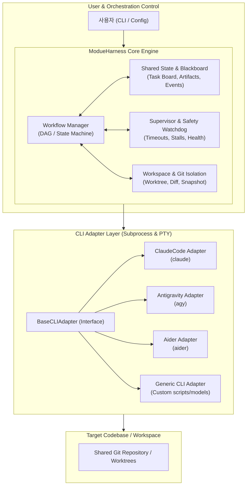
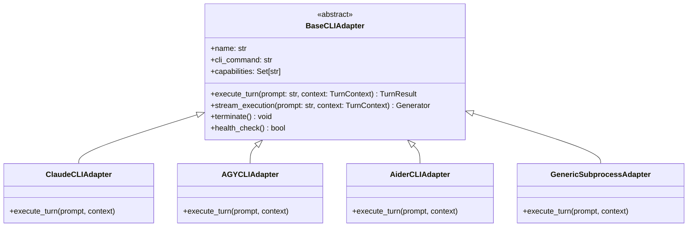
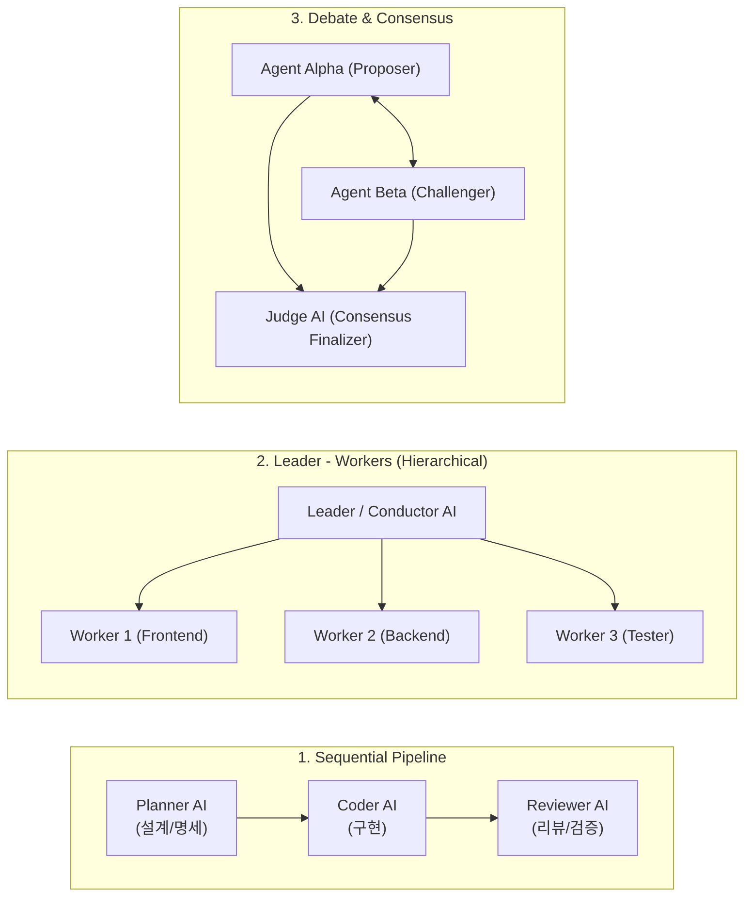
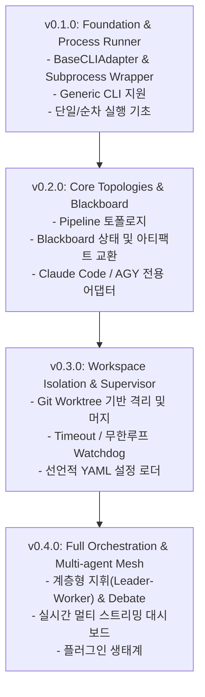

# ModueHarness: Multi-AI CLI Collaboration Harness Architecture Design

## 1. 개요 (Overview)

**ModueHarness(모두의 하네스)**는 서로 다른 AI CLI 도구(예: `claude`, `agy`, `aider`, `copilot`, `gemini` 등)를 하나의 유기적인 팀으로 오케스트레이션하여 단일 AI 도구의 한계를 극복하고 복잡한 소프트웨어 엔지니어링 작업을 자율적·협업적으로 해결하는 하네스(Harness) 프레임워크입니다.

### 1.1 핵심 가치 및 목표
- **도구 독립성 (CLI-Agnostic Abstraction)**: 상이한 인터페이스(입출력 스트림, PTY 지원, 배치 플래그, 종료 조건 등)를 가진 다양한 AI CLI를 통일된 어댑터 인터페이스로 추상화.
- **다양한 협업 토폴로지 (Flexible Collaboration Topologies)**: 파이프라인(순차), 리더-워커(계층형 분업), 교차 검증/토론(Consensus & Review), 블랙보드(작업 큐 공유) 지원.
- **작업 격리 및 안전성 (Isolation & Workspace Safety)**: Git Worktree/브랜치 기반 작업 격리, 롤백 지원, 무한 루프 감지 및 타임아웃 감시.
- **선언적 워크플로우 (Declarative Configuration)**: YAML/TOML을 통한 팀 구성, 역할 정의, 통신 채널, 단계별 워크플로우 정의.

---

## 2. 전체 시스템 아키텍처



---

## 3. 핵심 컴포넌트 설계

### 3.1 CLI Adapter 계층 (`modue_harness.adapters`)
각 AI CLI는 실행 방식(인터랙티브 vs 비인터랙티브), 프롬프트 입력 방식(STDIN, 인자), 스트리밍 출력 형식, ANSI 컬러 코드, 세션 유지 여부가 다릅니다. 이를 통일된 추상화로 다룹니다.



- **입출력 정규화**:
  - `TurnContext`: 이전 에이전트가 생성한 요약, 파일 변경 내역(Git Diff), 목표, 제약사항 주입.
  - `TurnResult`: 표준화된 상태(성공, 실패, 추가입력 필요), 순수 텍스트 결과물(ANSI 제거), 수정된 파일 목록, 실행 소요 시간.
- **실행 모드 지원**:
  - **Batch/Headless Mode**: 단일 턴 실행 후 종료 (예: `claude -p "..."`, `aider --message "..." --yes-always`).
  - **Persistent Session Mode**: 프로세스를 유지하고 파이프/PTY를 통해 대화형 통신 지속.

---

### 3.2 협업 토폴로지 모델 (`modue_harness.engine.topologies`)



1. **파이프라인 (Pipeline / Relay)**:
   - 한 AI CLI의 산출물(명세서, 코드 diff, 테스트 결과)이 다음 AI CLI의 입력 컨텍스트로 전달.
   - 예: `Claude Code`가 아키텍처/작업 계획 작성 -> `Aider`가 코드 작성 -> `AGY`가 테스트 및 코드 리뷰 수행.
2. **계층형 지휘 (Leader-Worker)**:
   - Conductor AI가 큰 태스크를 하위 태스크(Sub-tasks)로 쪼개고, 각 전문 CLI 워커에게 분배한 뒤 결과를 취합.
3. **토론 및 상호 검증 (Debate & Consensus)**:
   - 두 AI CLI가 동일한 문제에 대해 서로 다른 방안을 제시하고 교차 비판 후, 판정관(Judge) AI가 최종안 채택.

---

### 3.3 공유 상태 및 블랙보드 (`modue_harness.core.blackboard`)
AI CLI들이 직접 메모리를 공유할 수 없으므로, **프로젝트 폴더 내 가시적인 디렉터리(`blackboard/`)** 기반의 **Blackboard(공유 게시판)**를 매개체로 통신합니다.

> **프로젝트 루트 가시 폴더(`blackboard/`) 네이밍 및 배치 이유**:
> - **의미적 명확성 (Blackboard Architecture)**: 여러 전문 AI 에이전트들이 공용 칠판(Blackboard)을 보고 자신의 작업을 찾고, 결과물을 게시하며, 상호 피드백을 남기는 소프트웨어 아키텍처 패턴의 의미를 가장 직관적으로 전달합니다.
> - **인덱싱 친화성**: 숨김 폴더(`.`)가 아니므로 Claude, AGY, Aider 등 모든 AI CLI가 무시하지 않고 즉시 읽고 참조할 수 있습니다.
> - **직관적 검사**: 개발자가 탐색기나 터미널에서 `blackboard/`를 열어 현재 어떤 태스크가 진행 중이고 어떤 산출물(계획, 코드, 리뷰)이 나왔는지 바로 열람할 수 있습니다.
> - 기본 디렉터리 경로는 `blackboard/`이며 설정 파일에서 커스텀 경로로 변경 가능합니다.

```
blackboard/                 # 프로젝트 루트 내 AI 협업 공용 칠판 (공유 공간)
├── state.json              # 현재 워크플로우 진행 상태, 활성 에이전트, 세션 메트릭
├── tasks/                  # 분업 하위 태스크 명세 및 할당 상태
│   ├── task_001.json
│   └── task_002.json
├── artifacts/              # 에이전트 간 전달되는 문서, 다이어그램, 패치
│   ├── plan.md
│   ├── patch_feature_x.diff
│   └── review_feedback.md
└── logs/                   # 각 AI CLI의 원시 실행 트랜스크립트
    ├── claude_step1.log
    └── agy_step2.log
```

---

### 3.4 워크스페이스 격리 및 Git 관리 (`modue_harness.workspace`)
여러 AI CLI가 동일한 작업 디렉터리를 동시에 수정할 때 발생하는 충돌을 방지합니다.

- **Git Worktree 격리**:
  - 각 AI CLI에게 별도의 `git worktree`(`branch: harness/<run-id>/<agent-role>`)를 제공.
  - 작업 완료 시 Diff를 추출하거나 자동 리베이스/머지 수행.
- **스냅샷 및 롤백**:
  - 각 에이전트 턴 시작 전 자동 `git stash` 또는 임시 커밋 생성.
  - 에이전트가 잘못된 수정을 하거나 빌드가 깨질 경우 즉시 롤백 가능.

---

### 3.5 안전 감시자 (`modue_harness.core.supervisor`)
- **타임아웃 감시 (Timeout Watchdog)**: 특정 CLI가 사용자 대기 또는 무한 응답 상태에 빠질 경우 감지 및 프로세스 강제 종료.
- **루프 탐지 (Stall/Loop Detection)**: 동일한 파일 수정이나 반복된 에러 출력이 N회 이상 감지되면 개입.
- **Human-In-The-Loop**: 중요 단계(예: 메인 브랜치 머지, 외부 배포) 전 사용자 승인 프롬프트 지원.

---

## 4. 설정 파일 명세 (선언적 YAML 예시)

사용자가 간단한 YAML 파일로 협업 팀과 흐름을 정의할 수 있습니다.

```yaml
# modue_harness.yaml
version: "0.1.0"
name: "fullstack-feature-team"

# 1. 협업에 참여할 AI CLI 프로필
agents:
  planner:
    adapter: "claude"
    command: "claude"
    args: ["--permission-mode", "auto"]
    role: "System Architect & Planner"

  coder:
    adapter: "agy"
    command: "agy"
    role: "Core Implementation Engineer"

  reviewer:
    adapter: "claude"
    command: "claude"
    role: "Code Quality & Security Reviewer"

# 2. 작업 토폴로지 및 흐름 정의
workflow:
  topology: "pipeline"
  timeout_per_step: 300
  isolation: "worktree"
  steps:
    - id: "spec_and_plan"
      agent: "planner"
      instruction: "사용자 요구사항을 분석하여 상세 구현 계획서(plan.md)를 작성하라."
      output_artifact: "blackboard/artifacts/plan.md"

    - id: "implementation"
      agent: "coder"
      input_artifacts: ["blackboard/artifacts/plan.md"]
      instruction: "plan.md에 명시된 명세에 따라 코드를 작성하고 단위 테스트를 통과시켜라."

    - id: "code_review"
      agent: "reviewer"
      input_artifacts: ["blackboard/artifacts/plan.md"]
      instruction: "작성된 코드의 품질, 보안, 엣지 케이스를 리뷰하고 종합 평가를 작성하라."
```

---

## 5. 단계별 개발 로드맵



| 마일스톤 | 버전 | 핵심 목표 |
|---|---|---|
| **Phase 1** | `0.1.0` | CLI Subprocess 어댑터 기본 추상화, 스트림 입출력 캡처, 기본 CLI 실행기 |
| **Phase 2** | `0.2.0` | 릴레이/파이프라인 토폴로지, Blackboard 파일 기반 아티팩트 교환, 주요 CLI 어댑터(`claude`, `agy`) |
| **Phase 3** | `0.3.0` | Git Worktree 격리, Supervisor 안전 감시(타임아웃/루프 방지), YAML 워크플로우 엔진 |
| **Phase 4** | `0.4.0` | 동적 분업(Leader-Worker), 토론/합의 모델, 플러그인 확장 체계 |
