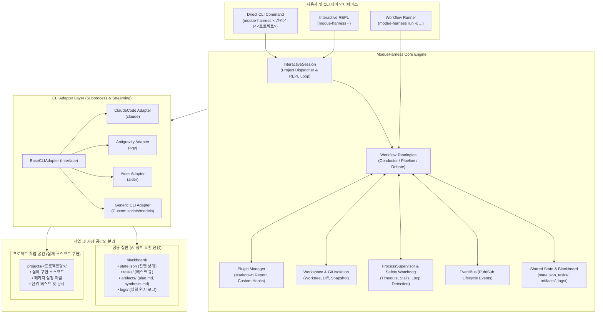
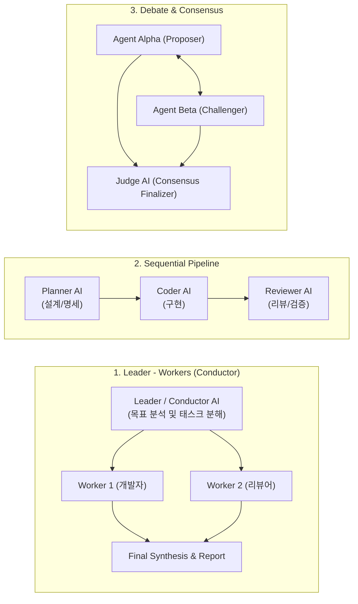

# ModueHarness: Multi-AI CLI Collaboration Harness Architecture Design

## 1. 개요 및 핵심 가치 (Overview)

**ModueHarness(모두의 하네스)**는 서로 다른 AI CLI 도구(예: `claude`, `agy`, `aider`, `copilot`, `gemini` 등)를 하나의 유기적인 팀으로 오케스트레이션하여 소프트웨어 엔지니어링 작업을 자율적·협업적으로 해결하는 하네스(Harness) 프레임워크입니다.

### 1.1 핵심 가치
- **도구 독립성 (CLI-Agnostic Abstraction)**: 상이한 인터페이스(입출력 스트림, PTY 지원, 배치 플래그, 종료 조건 등)를 가진 다양한 AI CLI를 통일된 어댑터 인터페이스(`BaseCLIAdapter`)로 추상화.
- **공용 칠판과 실제 구현 공간의 분리 (Separation of Coordination & Implementation)**: AI 간 협업 정보 교환(`blackboard/`)과 실제 소스 코드 구현 공간(`projects/<프로젝트명>/`)을 명확히 격리하여 안전하고 깔끔한 프로젝트 관리 보장.
- **자연어 CLI 및 대화형 협업 (Interactive CLI & REPL)**: 복잡한 워크플로우 YAML 파일 작성 없이, 터미널에서 자연어 명령을 직접 입력하여 Conductor(Leader)와 Worker가 프로젝트를 자율 구현.
- **다양한 협업 토폴로지 (Flexible Collaboration Topologies)**: 지휘자-워커(Conductor, 계층형 분업 및 종합), 파이프라인(순차 릴레이), 교차 검증/토론(Debate & Consensus) 지원.
- **작업 격리 및 안전성 (Isolation & Workspace Safety)**: Git Worktree 기반 임시 브랜치 격리, 스냅샷 롤백(`git stash`), 무응답 및 무한 루프 감시.

---

## 2. 전체 시스템 아키텍처

---

## 3. 핵심 컴포넌트 상세

### 3.1 공용 칠판(`blackboard/`)과 프로젝트 공간(`projects/`)의 분리
ModueHarness는 AI 간 통신과 실제 구현 코드의 오염을 방지하기 위해 저장소를 이원화합니다:

1. **공용 칠판 (`blackboard/`)**:
   - AI 에이전트들이 메모리를 직접 공유하지 않고 파일 기반으로 상태와 결과물을 안전하게 교환하는 가시적 공간.
   - `state.json`: 현재 세션, 활성 프로젝트, 진행 상태
   - `tasks/`: 서브태스크 정의 및 진행 현황 (`task_1.json` 등)
   - `artifacts/`: 기획서(`plan.md`), 판정 합의안(`consensus.md`), 최종 종합 보고서(`synthesis_report.md`)
   - `logs/`: 각 AI CLI의 프로세스 stdout/stderr 원시 로그

2. **프로젝트 작업 공간 (`projects/<프로젝트명>/`)**:
   - AI CLI 어댑터가 실행될 때 서브프로세스의 작업 디렉터리(`cwd`)로 지정됩니다.
   - AI 에이전트(Claude Code, AGY, Aider 등)가 직접 파일 생성, 편집, 테스트 명령을 수행하는 격리된 실제 소스코드 디렉터리입니다.
   - `.gitignore`에 등록되어 ModueHarness 프레임워크 자체 저장소와 분리 관리됩니다.

---

### 3.2 대화형 CLI 세션 (`InteractiveSession`)
- 사용자가 복잡한 YAML 워크플로우를 작성하지 않고도 터미널에서 즉시 프로젝트를 개발할 수 있도록 지원합니다.
- 시스템 환경에 설치된 AI CLI(`claude`, `agy`, `aider`)를 자동 감지하여 Leader(아키텍트)와 Worker(개발자, 리뷰어) 팀을 즉시 구성합니다.
- `/project <이름>`, `/projects`, `/files`, `/status` 등의 슬래시 명령어로 다중 프로젝트를 유연하게 전환하고 관리할 수 있습니다.

---

### 3.3 협업 토폴로지 모델 (`modue_harness.engine`)

1. **계층형 지휘 (Leader-Worker / Conductor - `ConductorRunner`)**:
   - 사용자의 자연어 목표를 Conductor(Leader)가 받아 `blackboard/tasks`에 하위 태스크(JSON)로 분해 등록.
   - Worker 에이전트들이 `projects/<프로젝트명>/`에서 실제 코드를 구현.
   - Conductor가 종합 검토 보고서(`synthesis_report.md`)를 작성하여 사용자에게 최종 보고.
2. **파이프라인 (Pipeline / Relay - `PipelineRunner`)**:
   - 정적 워크플로우 명세 기반으로 산출물을 연쇄 전달하는 순차 파이프라인.
3. **토론 및 합의 (Debate & Consensus - `DebateRunner`)**:
   - 둘 이상의 AI 간 교차 토론 및 판정관 최종 합의안 도출.

---

### 3.4 CLI Adapter 계층 (`modue_harness.adapters`)
- **`BaseCLIAdapter`**: 서브프로세스 격리 실행, 스트리밍 출력, ANSI 이스케이프 시퀀스 제거, 표준화된 `TurnResult` 생성.
- **구현체**:
  - `ClaudeCLIAdapter`: Anthropic Claude Code (`claude -p`, `--permission-mode auto`)
  - `AGYCLIAdapter`: Google Antigravity CLI (`agy`)
  - `AiderCLIAdapter`: Aider (`aider --yes-always --no-git`)
  - `GenericCLIAdapter`: Python 스크립트, 로컬 LLM, 임의의 CLI 명령어 지원

---

### 3.5 워크스페이스 격리 및 안전 감시 (`workspace`, `supervisor`)
- **Git Worktree 격리**: 격리 실행 옵션 시 별도의 임시 `git worktree`에서 브랜치를 분기하여 작업 후 안전하게 병합 또는 정리.
- **프로세스 감시자 (`ProcessSupervisor`)**: 무응답 지연(Stall), 무한 루프, 비정상 대기를 감시하고 타임아웃 강제 종료.

---

## 4. 단계별 개발 로드맵

| 마일스톤 | 버전 | 핵심 목표 | 상태 |
|---|---|---|---|
| **Phase 1** | `0.1.0` | CLI Subprocess 어댑터 기본 추상화, 스트림 입출력 캡처, 기본 CLI 실행기 | ✅ 완료 |
| **Phase 2** | `0.2.0` | 릴레이/파이프라인 토폴로지, Blackboard 파일 기반 아티팩트 교환, 주요 CLI 어댑터(`claude`, `agy`) | ✅ 완료 |
| **Phase 3** | `0.3.0` | Git Worktree 격리, Supervisor 안전 감시(타임아웃/루프 방지), 조건부/재시도 엔진 | ✅ 완료 |
| **Phase 4** | `0.4.0` | 동적 분업(Leader-Worker), 토론/합의 모델, 플러그인 확장 체계, 보고서 생성기 | ✅ 완료 |
| **Phase 5** | `0.5.0` | 대화형 CLI(REPL) 및 단일 명령 직접 실행, blackboard와 projects 폴더의 이원화 격리 | ✅ 완료 |
