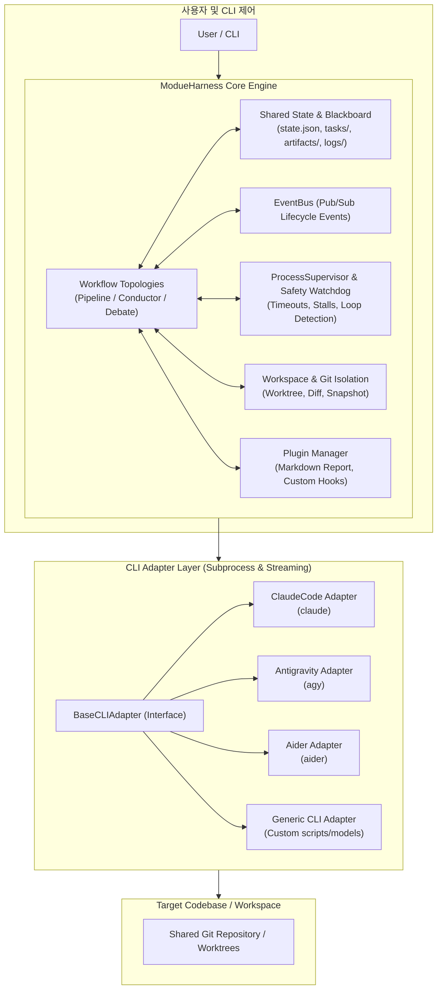
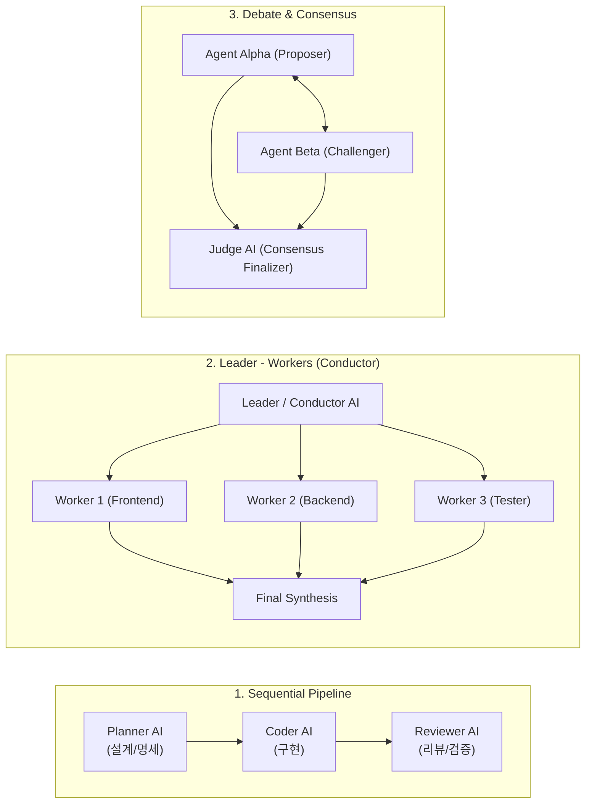

# ModueHarness: Multi-AI CLI Collaboration Harness Architecture Design

## 1. 개요 및 핵심 가치 (Overview)

**ModueHarness(모두의 하네스)**는 서로 다른 AI CLI 도구(예: `claude`, `agy`, `aider`, `copilot`, `gemini` 등)를 하나의 유기적인 팀으로 오케스트레이션하여 소프트웨어 엔지니어링 작업을 자율적·협업적으로 해결하는 하네스(Harness) 프레임워크입니다.

### 1.1 핵심 가치
- **도구 독립성 (CLI-Agnostic Abstraction)**: 상이한 인터페이스(입출력 스트림, PTY 지원, 배치 플래그, 종료 조건 등)를 가진 다양한 AI CLI를 통일된 어댑터 인터페이스(`BaseCLIAdapter`)로 추상화.
- **다양한 협업 토폴로지 (Flexible Collaboration Topologies)**: 파이프라인(순차 릴레이), 리더-워커(계층형 분업 및 종합), 교차 검증/토론(Debate & Consensus), 블랙보드(작업 큐 공유) 지원.
- **작업 격리 및 안전성 (Isolation & Workspace Safety)**: Git Worktree 기반 임시 브랜치 격리, 원클릭 스냅샷 롤백(`git stash`), 무응답 및 무한 루프 감시.
- **선언적 워크플로우 (Declarative Configuration)**: AI 팀 명세(`agents.yaml`)와 작업 명세(`workflow.yaml`)를 분리하여 재사용성과 유연성 극대화.

---

## 2. 전체 시스템 아키텍처



---

## 3. 핵심 컴포넌트 상세

### 3.1 CLI Adapter 계층 (`modue_harness.adapters`)
각 AI CLI는 실행 방식(인터랙티브 vs 비인터랙티브), 프롬프트 입력 방식(STDIN, 인자), 스트리밍 출력 형식, ANSI 컬러 코드, 세션 유지 여부가 다릅니다. 이를 통일된 추상화로 다룹니다.

- **`BaseCLIAdapter`**:
  - `execute()`: 서브프로세스 격리 실행, ANSI 색상 시퀀스 자동 제거, 결과 정규화(`TurnResult`).
  - `execute_stream()`: 실시간 라인 단위 stdout 스트리밍 제너레이터 제공.
  - 시스템 디렉티브 및 아티팩트 자동 주입.
- **특화 어댑터 구현체**:
  - `ClaudeCLIAdapter`: Anthropic Claude Code (`claude -p`, `--permission-mode`, `--model`).
  - `AGYCLIAdapter`: Google Antigravity CLI (`agy`, stdin 전달, `--model`).
  - `AiderCLIAdapter`: Aider (`aider --message`, `--yes-always`, `--no-git`, `--model`).
  - `GenericCLIAdapter`: 임의의 쉘 스크립트나 로컬 모델 CLI 실행.

---

### 3.2 협업 토폴로지 모델 (`modue_harness.engine`)



1. **파이프라인 (Pipeline / Relay - `PipelineRunner`)**:
   - 한 AI CLI의 산출물(명세서, 코드 diff, 테스트 결과)이 다음 AI CLI의 입력 컨텍스트로 전달.
   - 조건부 실행 (`condition: artifact_exists:...`), 템플릿 변수 치환 (`${artifact:...}`), 재시도(`retry_count`), 대체 위임(`fallback_agent`) 지원.
2. **계층형 지휘 (Leader-Worker / Conductor - `ConductorRunner`)**:
   - 지휘자(Conductor) AI가 큰 목표를 동적으로 하위 태스크(JSON)로 분해하고, 전문 워커 에이전트들에게 할당·수행 후 최종 결과를 종합 보고서(`synthesis_report.md`)로 취합.
3. **토론 및 상호 검증 (Debate & Consensus - `DebateRunner`)**:
   - 제안자(Proposer)와 도전자(Challenger) 간 다자 토론 라운드를 진행하고, 판정관(Judge) AI가 최적 합의안(`consensus.md`)을 도출.

---

### 3.3 공유 상태 및 공용 칠판 (`modue_harness.core.blackboard`)
AI CLI들이 직접 메모리를 공유할 수 없으므로, **프로젝트 폴더 내 가시적인 디렉터리(`blackboard/`)** 기반의 **Blackboard(공유 게시판)**를 매개체로 통신합니다.

```
blackboard/                 # 프로젝트 루트 내 AI 협업 공용 칠판 (가시적 폴더)
├── state.json              # 현재 워크플로우 진행 상태, 세션 ID, 메트릭
├── tasks/                  # 단계별 하위 태스크 명세 및 결과
│   ├── task_001.json
│   └── task_002.json
├── artifacts/              # 에이전트 간 전달되는 문서, 다이어그램, 패치
│   ├── plan.md
│   ├── .plan.md.meta.json  # 산출물 작성자, 크기, 시각 메타데이터
│   └── consensus.md
└── logs/                   # 각 AI CLI의 원시 실행 덤프 로그 (git ignore 처리)
    ├── claude_step1.log
    └── agy_step2.log
```

---

### 3.4 워크스페이스 격리 및 Git 관리 (`modue_harness.workspace`)
여러 AI CLI가 동일한 작업 디렉터리를 수정할 때 발생하는 충돌을 원천 차단합니다.

- **Git Worktree 격리**:
  - 각 AI CLI에게 별도의 `git worktree`(`branch: harness/<run-id>/<step-id>`)를 제공하여 변경을 분리.
  - 작업 완료 후 Diff 추출 및 안전한 리소스 정리(Prune).
- **스냅샷 및 롤백**:
  - 턴 시작 전 자동 `git stash` 스냅샷 생성.
  - 에이전트가 잘못된 수정을 하거나 빌드가 깨질 경우 즉시 롤백 가능.

---

### 3.5 안전 감시자 (`modue_harness.core.supervisor`)
- **타임아웃 감시 (Timeout Watchdog)**: 특정 CLI가 사용자 대기 또는 무한 응답 상태에 빠질 경우 감지 및 프로세스 강제 종료.
- **무응답 지연 감지 (Stall Detection)**: 출력 없이 `stall_timeout`을 초과한 정체 프로세스 조기 감지.
- **루프 탐지 (Loop Detection)**: 동일한 에러나 텍스트 출력이 임계치 이상 반복될 때 무한 루프로 판단하고 차단.
- **Human-In-The-Loop**: 중요 단계(예: 메인 브랜치 반영, 외부 배포) 전 사용자 승인 프롬프트(`requires_approval`) 지원.

---

### 3.6 생명주기 이벤트 및 플러그인 (`core.events`, `plugins`)
- **`EventBus`**: `WORKFLOW_STARTED`, `STEP_COMPLETED`, `ARTIFACT_PRODUCED`, `TASK_STATUS_CHANGED` 등 실시간 생명주기 이벤트 브로커.
- **`PluginManager`**:
  - `BasePlugin`: 라이프사이클 전 단계에 결합 가능한 훅 인터페이스.
  - `MarkdownReportPlugin`: 워크플로우 종료 시 세부 단계별 실행 시간, 성공 여부, 에러 노트를 담은 마크다운 종합 보고서 자동 생성.

---

## 4. 단계별 개발 로드맵

| 마일스톤 | 버전 | 핵심 목표 | 상태 |
|---|---|---|---|
| **Phase 1** | `0.1.0` | CLI Subprocess 어댑터 기본 추상화, 스트림 입출력 캡처, 기본 CLI 실행기 | ✅ 완료 |
| **Phase 2** | `0.2.0` | 릴레이/파이프라인 토폴로지, Blackboard 파일 기반 아티팩트 교환, 주요 CLI 어댑터(`claude`, `agy`) | ✅ 완료 |
| **Phase 3** | `0.3.0` | Git Worktree 격리, Supervisor 안전 감시(타임아웃/루프 방지), 조건부/재시도 엔진 | ✅ 완료 |
| **Phase 4** | `0.4.0` | 동적 분업(Leader-Worker), 토론/합의 모델, 플러그인 확장 체계, 보고서 생성기 | ✅ 완료 |
